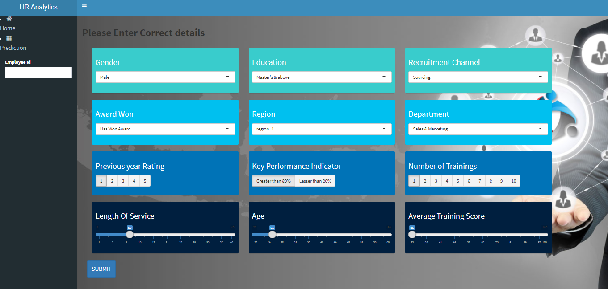

# HR_Analytics
*Objective*
In this project based on employee data we predict whether that individual would get promoted or not. This can be used by the company to promote a employee or not. An R-Shiny UI was built for this project.

*Data Description*
- The HR analytics dataset is divided into train and test data
- Train data consists of 54808 rows and 14 features.
- Test data consists of 23490 rows and 14 features.
- The dataset contains 6 numerical features and 8 categorical features.
- Data includes the features such as employee_id, department, education, awards_won, age, gender etc.

*Modelling*
Run the Modelling.R file to get model for our prediction. Using Modelling.R file we dump two R files Data.rds and rf.rds which is then used in server.R to predict whether employee would get promoted or not. We are using random forest classifier model to classify.

*User-Interface*
UI.R file gives the user interface, while the adjacent server.R connected to that is used to run the background model to predict. 

Link to Shinyapps.io - "https://hemanthk701.shinyapps.io/hr-analytics/"

Link to presentation - "https://www.slideshare.net/HemanthKumar1434/hr-analytics-presentation-241683987"

**Screenshot of the project application**
 
